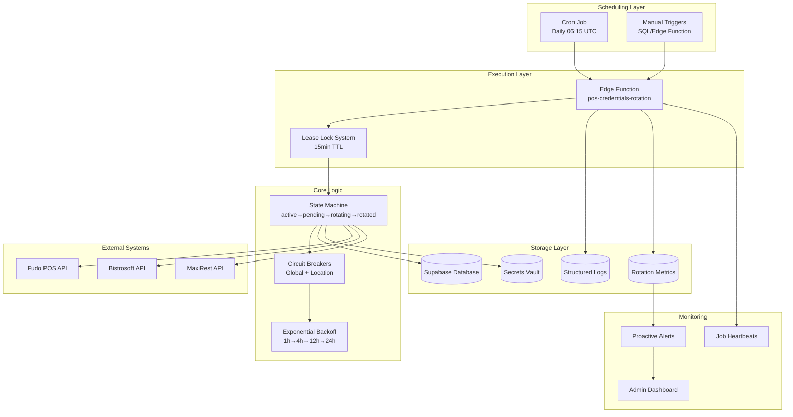
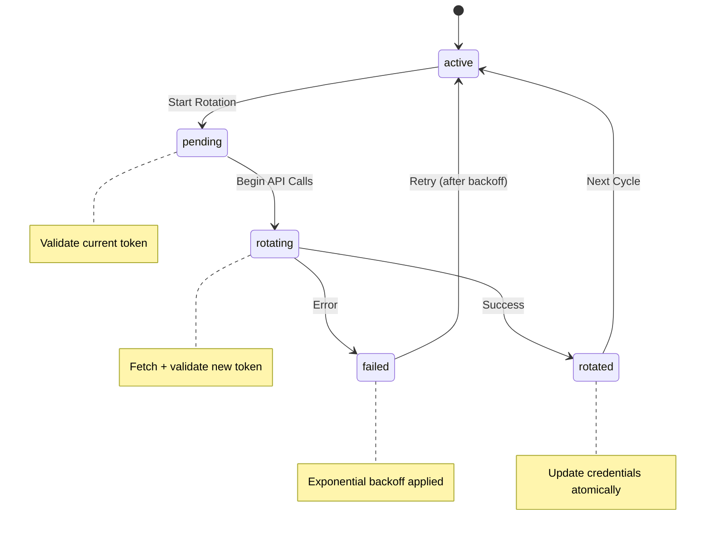
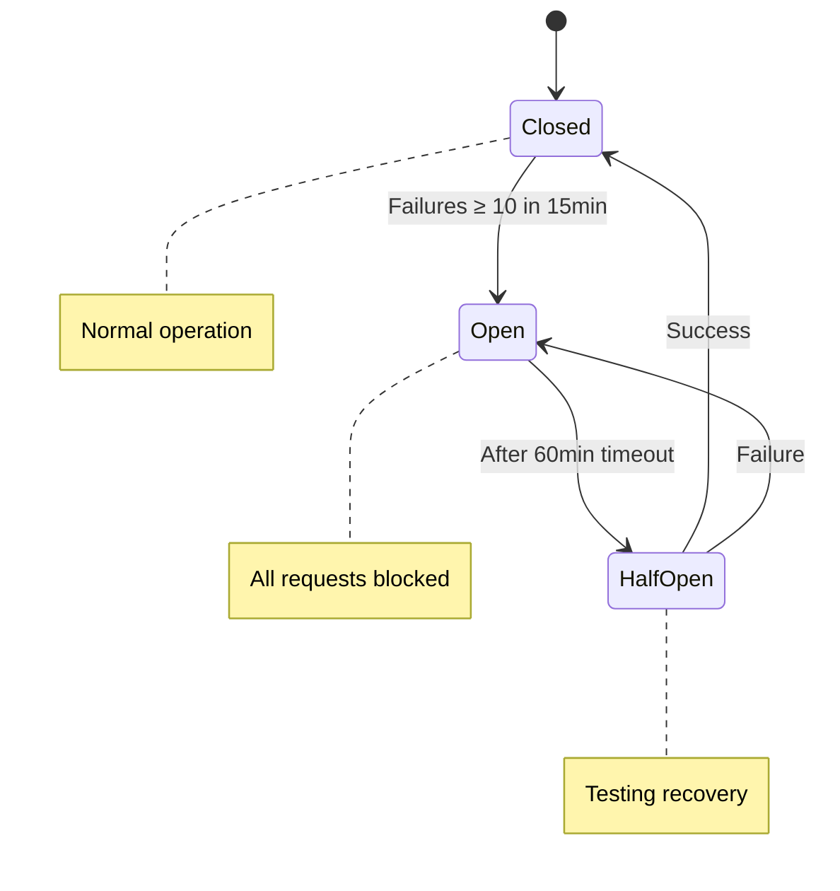
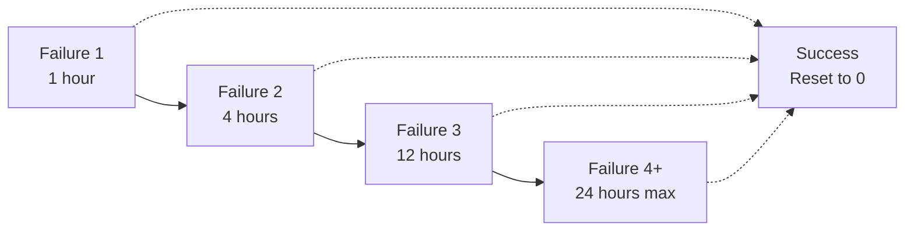
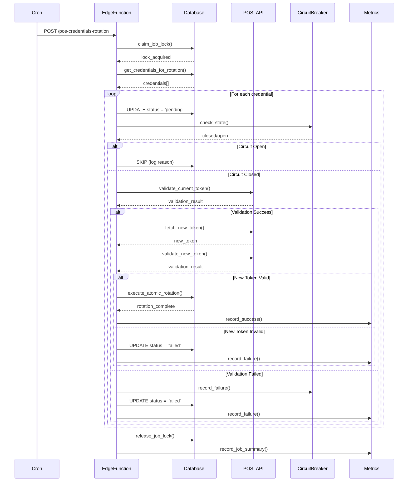

# POS Credentials Rotation - System Architecture

## Overview
The POS Credentials Rotation system is a production-ready, automated token rotation infrastructure designed for enterprise-grade reliability, security, and observability. It handles credential lifecycle management for multiple POS providers with bulletproof concurrency control and comprehensive failure handling.

## High-Level Architecture



## Core Components

### 1. Scheduling & Triggers

#### Automated Cron Job
- **Schedule**: Daily at 06:15 UTC (`15 6 * * *`)
- **Dynamic Configuration**: Uses `app_settings.edge_base_url`
- **Authentication**: `vault.decrypted_secret('POS_SYNC_JOB_TOKEN')`
- **Payload**: `{"scheduled": true, "timestamp": "...", "trigger": "cron"}`

#### Manual Triggers
- **SQL Function**: `public.trigger_pos_credentials_rotation()`
- **Edge Function**: Direct HTTP POST with job token
- **Admin Interface**: Dashboard trigger with audit logging

### 2. Concurrency Control

#### Lease Lock System
```sql
-- Database-level lease lock ensures single execution
CREATE TABLE job_locks (
  name text PRIMARY KEY,
  lease_until timestamptz NOT NULL,
  holder text NOT NULL,
  updated_at timestamptz DEFAULT now()
);

-- Lock acquisition with TTL
SELECT public.claim_job_lock('pos-credentials-rotation', 900); -- 15 min TTL
```

**Guarantees**:
- Only one rotation job runs simultaneously
- Automatic cleanup after TTL expiration
- Prevents duplicate cron executions

#### Row-Level Locking
```sql
-- Per-credential locking during processing
SELECT * FROM pos_credentials 
WHERE rotation_status IN ('active', 'failed')
  AND (next_attempt_at IS NULL OR next_attempt_at <= now())
FOR UPDATE SKIP LOCKED;
```

**Benefits**:
- Parallel processing of different credentials
- No blocking on busy credentials
- Maximizes throughput while preventing conflicts

### 3. State Machine



#### State Definitions
- **active**: Ready for rotation when expiring
- **pending**: Rotation started, validating current token
- **rotating**: Fetching and validating new token
- **rotated**: Successfully updated with new token
- **failed**: Error occurred, backoff applied

#### Transition Guarantees
- **Atomicity**: State changes are transactional
- **Idempotency**: Same rotation_id can be safely retried
- **Auditability**: All transitions logged with correlation IDs

### 4. Circuit Breaker System



#### Hybrid Circuit Breakers
1. **Global Breaker**: Provider-level (affects all locations)
2. **Location Breaker**: Provider + location_id specific

#### Error Classification
- **Non-breaking**: 401, 403, 422 (credential/config issues)
- **Breaking**: 429, 5xx, timeouts (service issues)

#### Configuration
- **Failure Threshold**: 10 failures in 15-minute window
- **Open Duration**: 60 minutes
- **Recovery**: Automatic via half-open state

### 5. Exponential Backoff



#### Backoff Formula
```typescript
const backoffHours = Math.min(Math.pow(2, failures - 1), 24);
next_attempt_at = now() + interval `${backoffHours} hours`;
```

#### Reset Conditions
- Successful rotation resets `consecutive_rotation_failures` to 0
- Circuit breaker opening doesn't count as "failure" for backoff
- Manual resets via admin interface

### 6. Data Flow

#### Rotation Execution Flow


### 7. Database Schema

#### Core Tables
```sql
-- Credential storage with encryption
CREATE TABLE pos_credentials (
  location_id text NOT NULL,
  provider text NOT NULL,
  ciphertext text NOT NULL,          -- Encrypted token
  expires_at timestamptz,
  rotation_status text DEFAULT 'active',
  rotation_id uuid,                  -- Current rotation attempt
  rotation_attempt_id uuid,          -- Links to provider credentials
  consecutive_rotation_failures int DEFAULT 0,
  next_attempt_at timestamptz,       -- Backoff schedule
  rotation_error_code text,          -- Last error classification
  rollback_ciphertext text,          -- Previous token for rollback
  rollback_expires_at timestamptz,
  last_rotation_at timestamptz,
  created_at timestamptz DEFAULT now(),
  updated_at timestamptz DEFAULT now(),
  PRIMARY KEY (location_id, provider)
);

-- Provider-specific credential attempts
CREATE TABLE pos_provider_credentials (
  id uuid PRIMARY KEY DEFAULT gen_random_uuid(),
  location_id text NOT NULL,
  provider text NOT NULL,
  rotation_attempt_id uuid NOT NULL UNIQUE,
  ciphertext text NOT NULL,
  status text DEFAULT 'pending',    -- pending/active/failed
  last_verified_at timestamptz,
  created_at timestamptz DEFAULT now(),
  updated_at timestamptz DEFAULT now()
);

-- Circuit breaker state
CREATE TABLE rotation_cb (
  provider text NOT NULL,
  location_id text,                 -- NULL for global breaker
  state text DEFAULT 'closed',     -- closed/open/half_open
  failures int DEFAULT 0,
  window_start timestamptz DEFAULT now(),
  resume_at timestamptz,            -- When to attempt half_open
  updated_at timestamptz DEFAULT now(),
  PRIMARY KEY (provider, COALESCE(location_id, ''))
);

-- Rotation metrics and observability
CREATE TABLE pos_rotation_metrics (
  id uuid PRIMARY KEY DEFAULT gen_random_uuid(),
  provider text NOT NULL,
  location_id text,
  metric_type text NOT NULL,       -- rotation_attempt/job_summary
  value numeric,
  duration_ms integer,
  meta jsonb DEFAULT '{}',         -- rotation_id, status, error details
  recorded_at timestamptz DEFAULT now()
);

-- Job execution locks
CREATE TABLE job_locks (
  name text PRIMARY KEY,
  lease_until timestamptz NOT NULL,
  holder text NOT NULL,
  updated_at timestamptz DEFAULT now()
);
```

#### Key Indexes
```sql
-- Performance indexes for rotation queries
CREATE INDEX pos_credentials_rotation_lookup 
  ON pos_credentials(provider, rotation_status, expires_at, next_attempt_at);

CREATE INDEX pos_rotation_metrics_analysis
  ON pos_rotation_metrics(provider, recorded_at, metric_type) 
  INCLUDE (location_id, duration_ms, meta);

CREATE INDEX rotation_cb_state_lookup
  ON rotation_cb(provider, state, location_id);

CREATE INDEX job_locks_lease_lookup
  ON job_locks(lease_until, name);
```

### 8. Security Architecture

#### Encryption at Rest
- **Token Storage**: AES-256-GCM with Supabase Vault
- **Key Management**: Automated key rotation
- **Access Control**: Service role with minimal permissions

#### Access Control
```sql
-- RLS policies for credential access
ALTER TABLE pos_credentials ENABLE ROW LEVEL SECURITY;

CREATE POLICY "Admin access to credentials" ON pos_credentials
FOR ALL USING (public.is_tupa_admin());

CREATE POLICY "Service role access" ON pos_credentials
FOR ALL USING (current_user = 'service_role');
```

#### Audit Trail
- **Rotation IDs**: UUID v4 for correlation
- **Structured Logging**: No PII in logs
- **Metrics Storage**: 30-day retention with aggregation
- **Error Classification**: Standardized error codes

### 9. Observability

#### Metrics Collection
```typescript
// Key metrics tracked per rotation
interface RotationMetrics {
  rotation_id: string;           // Correlation ID
  provider: string;              // POS provider
  location_id: string;           // Location identifier
  metric_type: 'rotation_attempt' | 'job_summary';
  duration_ms: number;           // Operation duration
  status: 'rotated' | 'failed' | 'skipped';
  error_code?: string;           // Standardized error classification
  idempotent_hit: boolean;       // Whether operation was idempotent
}
```

#### Log Correlation
```typescript
// All logs include rotation_id for correlation
console.log(`[${rotation_id}] Starting rotation for location ${locationId}`);
console.log(`[${rotation_id}] Token validated for provider ${provider}`);
console.log(`[${rotation_id}] Atomic rotation completed: ${rowsUpdated} rows`);
```

#### Health Checks
- **Job Heartbeats**: Execution confirmation
- **Circuit Breaker Status**: Real-time failure detection
- **Credential Expiry**: Proactive alerting
- **Performance Metrics**: Duration and success rate tracking

### 10. Error Handling

#### Error Classification
```typescript
enum RotationErrorCode {
  // Authentication/Authorization
  INVALID_CREDENTIALS = 'auth_invalid',
  EXPIRED_TOKEN = 'auth_expired',
  INSUFFICIENT_PERMISSIONS = 'auth_permissions',
  
  // API/Network
  API_TIMEOUT = 'api_timeout',
  API_RATE_LIMIT = 'api_rate_limit',
  API_SERVER_ERROR = 'api_server_error',
  NETWORK_ERROR = 'network_error',
  
  // System
  DATABASE_ERROR = 'db_error',
  ENCRYPTION_ERROR = 'crypto_error',
  CIRCUIT_OPEN = 'circuit_open',
  
  // Validation
  TOKEN_VALIDATION_FAILED = 'validation_failed',
  TOKEN_FORMAT_INVALID = 'token_invalid_format'
}
```

#### Recovery Strategies
1. **Immediate Retry**: Network timeouts, temporary API errors
2. **Exponential Backoff**: Authentication failures, rate limits
3. **Circuit Breaking**: Service outages, persistent failures
4. **Manual Intervention**: Credential compromise, configuration errors

### 11. Performance Characteristics

#### Throughput
- **Batch Size**: 50 locations per execution (configurable)
- **Concurrency**: Row-level locking enables parallel processing
- **Duration**: ~30 seconds average for full rotation cycle

#### Scalability
- **Horizontal**: Multiple edge function instances supported
- **Database**: Optimized indexes for rotation queries
- **Provider APIs**: Rate limiting and circuit breaking

#### Resource Usage
- **Memory**: ~64MB per edge function instance
- **Database Connections**: 1 connection per execution
- **API Calls**: 2-3 calls per location (validate + fetch + validate)

## Deployment Architecture

### Edge Function Configuration
```typescript
// Environment variables and secrets
const config = {
  SUPABASE_URL: 'https://project.supabase.co',
  SUPABASE_SERVICE_ROLE_KEY: vault.secret('SUPABASE_SERVICE_KEY'),
  POS_SYNC_JOB_TOKEN: vault.secret('POS_SYNC_JOB_TOKEN'),
  ENCRYPTION_KEY: vault.secret('POS_ENCRYPTION_KEY')
};
```

### Database Extensions
```sql
-- Required PostgreSQL extensions
CREATE EXTENSION IF NOT EXISTS "uuid-ossp";    -- UUID generation
CREATE EXTENSION IF NOT EXISTS "pg_cron";      -- Cron job scheduling
CREATE EXTENSION IF NOT EXISTS "pg_net";       -- HTTP requests
CREATE EXTENSION IF NOT EXISTS "vault";        -- Secrets management
```

### Monitoring Integration
- **Supabase Dashboard**: Edge function logs and metrics
- **Admin Interface**: Real-time rotation status
- **Alert System**: Proactive failure detection
- **External Monitoring**: Webhook integration for third-party tools

---

**Documentation Status**: Production-ready  
**Last Updated**: 2025-01-21  
**Review Frequency**: Quarterly or after major changes  
**Target Audience**: Platform architects, senior engineers, DevOps teams