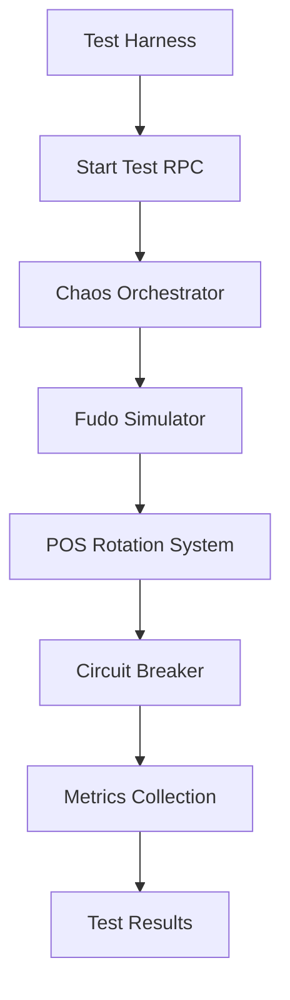

# Chaos Engineering Guide for POS Rotation System

## Overview

This guide covers the chaos engineering framework implemented to validate the resilience and reliability of the POS credential rotation system under adverse conditions.

## What is Chaos Engineering?

Chaos engineering is the practice of intentionally introducing failures into a system to test its resilience and identify weaknesses before they cause outages in production.

## Test Scenarios

### 1. Fudo 500 Server Errors (`fudo_500_errors`)

**Purpose**: Validate circuit breaker behavior when Fudo API returns persistent 500 errors.

**Configuration**:
- Error rate: 100% (all requests fail)
- Duration: 5 minutes
- Target endpoints: token, me

**Success Criteria**:
- Circuit breaker opens after 10 consecutive failures
- No credential corruption occurs
- System respects circuit breaker state

### 2. Rate Limiting 429 (`rate_limit_429`)

**Purpose**: Test exponential backoff and retry logic when hitting rate limits.

**Configuration**:
- Error rate: 80%
- Max retries: 3
- Base delay: 1000ms
- Max delay: 8000ms

**Success Criteria**:
- System respects backoff delays
- Never exceeds max retry attempts
- No rate limit violations occur

### 3. Network Timeouts (`timeout_30s`)

**Purpose**: Validate timeout handling and retry behavior.

**Configuration**:
- Timeout: 30 seconds
- Retry count: 2
- Failure rate: 70%

**Success Criteria**:
- Respects timeout limits
- Max 2 retries per request
- No hanging requests

### 4. Rotation Overload (`rotation_overload`)

**Purpose**: Test rotation rate limits and cooldown periods.

**Configuration**:
- Requests per minute: 100
- Duration: 10 minutes
- Burst size: 20

**Success Criteria**:
- Rate limits respected
- 4-hour cooldown periods enforced
- No system overload

## Running Chaos Tests

### Prerequisites

1. **Environment Setup**:
   ```bash
   export SUPABASE_SERVICE_ROLE_KEY="your-service-role-key"
   ```

2. **Admin Access**: Only platform administrators can run chaos tests.

### Command Line Interface

#### List Available Scenarios
```bash
npm run test:chaos list
```

#### Run Specific Scenario
```bash
npm run test:chaos fudo_500_errors --verbose
npm run test:chaos rate_limit_429 --location=abc-123 --duration=10
```

#### Run Complete Test Suite
```bash
npm run test:chaos all --verbose
```

### Test Options

- `--verbose, -v`: Enable detailed logging
- `--location <id>`: Target specific location
- `--duration <minutes>`: Override scenario duration
- `--force`: Bypass system validation warnings

## Programmatic Usage

```typescript
import { ChaosTestHarness } from './tests/chaos/chaos-test-harness';

const harness = new ChaosTestHarness();

// Run single scenario
const result = await harness.runScenario({
  scenarioId: 'fudo_500_errors',
  locationId: 'abc-123',
  verbose: true
});

// Run full test suite
const results = await harness.runTestSuite({
  locationId: 'abc-123',
  verbose: true
});
```

## Test Architecture

### Components

1. **Database Schema**:
   - `chaos_test_runs`: Track test executions
   - `chaos_scenarios`: Define test configurations
   - `chaos_test_metrics`: Record test metrics

2. **Edge Functions**:
   - `chaos-fudo-simulator`: Mock Fudo API with chaos injection
   - `chaos-test-orchestrator`: Coordinate test execution

3. **Test Harness**:
   - CLI interface for running tests
   - Validation and reporting
   - Integration with monitoring

### Data Flow



## Monitoring and Alerts

### Key Metrics

- **Request Counts**: Total, successful, failed
- **Error Rates**: By type (500, 429, timeout)
- **Circuit Breaker**: State transitions, open duration
- **Response Times**: P50, P95, P99
- **Retry Behavior**: Attempts, backoff compliance

### Violations Tracking

Tests automatically detect and report violations:
- Circuit breaker not opening when expected
- Exceeding retry limits
- Rate limit violations
- Cooldown period violations

## Best Practices

### Before Running Tests

1. **System Validation**: Check circuit breaker state, recent activity
2. **Off-Peak Hours**: Run during low-traffic periods
3. **Monitoring**: Ensure logging and metrics collection is active
4. **Rollback Plan**: Have system reset procedures ready

### During Tests

1. **Monitoring**: Watch system metrics and logs
2. **Documentation**: Record observations and anomalies
3. **Stop Conditions**: Be ready to abort if system becomes unstable

### After Tests

1. **Analysis**: Review metrics and violations
2. **Documentation**: Update runbooks based on findings
3. **Remediation**: Fix any issues discovered
4. **Validation**: Verify fixes with follow-up tests

## Troubleshooting

### Common Issues

1. **Test Timeout**: Increase poll interval or max wait time
2. **Rate Limiting**: Use `--force` flag to bypass validation
3. **Permission Denied**: Ensure admin role and correct service key
4. **Circuit Breaker Stuck**: Reset using admin functions

### Debug Commands

```bash
# Check system state
npm run test:chaos validate

# View recent test runs
npm run test:chaos history

# Reset circuit breakers
npm run test:chaos reset-breakers
```

## Integration with CI/CD

### Pre-Release Testing

```yaml
# .github/workflows/chaos-tests.yml
name: Chaos Tests
on:
  pull_request:
    branches: [main]
    
jobs:
  chaos:
    runs-on: ubuntu-latest
    steps:
      - uses: actions/checkout@v3
      - name: Run Chaos Tests
        run: npm run test:chaos all
        env:
          SUPABASE_SERVICE_ROLE_KEY: ${{ secrets.SUPABASE_SERVICE_ROLE_KEY }}
```

### Scheduled Testing

Run weekly chaos tests to ensure ongoing resilience:

```sql
SELECT cron.schedule(
  'weekly-chaos-tests',
  '0 2 * * 1', -- Every Monday at 2 AM
  $$
  SELECT net.http_post(
    url := 'https://ipjidjijilhpblxrnaeg.supabase.co/functions/v1/chaos-test-orchestrator',
    headers := '{"Content-Type": "application/json", "Authorization": "Bearer ' || current_setting('app.service_role_key') || '"}'::jsonb,
    body := '{"action": "start", "scenarioId": "fudo_500_errors"}'::jsonb
  );
  $$
);
```

## Security Considerations

1. **Admin Only**: Chaos tests require platform admin privileges
2. **Isolated Environment**: Run in staging/test environments when possible
3. **Service Key Protection**: Secure the service role key
4. **Audit Logging**: All chaos tests are logged for compliance
5. **Rate Limiting**: Built-in protection against runaway tests

## Reporting

### Test Reports

Each test generates a comprehensive report including:
- Scenario details and configuration
- Execution timeline
- Metrics and violations
- Success/failure determination
- Remediation recommendations

### Example Report

```
🎯 Scenario: Fudo 500 Server Errors
📈 Status: COMPLETED
⏱️  Duration: 287s
📊 Metrics:
   total_requests: 57
   failures_detected: 57
   circuit_breaker_opened: 1
   test_duration_ms: 287143
⚠️  Violations: None

✅ All success criteria met
```

## Contributing

When adding new chaos scenarios:

1. **Define Scenario**: Add to `chaos_scenarios` table
2. **Implementation**: Update orchestrator with scenario logic
3. **Validation**: Define clear success criteria
4. **Documentation**: Update this guide
5. **Testing**: Validate with dry runs

## Support

For issues or questions:
- Check logs in Supabase Functions dashboard
- Review chaos test metrics in database
- Consult troubleshooting section above
- Contact platform team for escalation