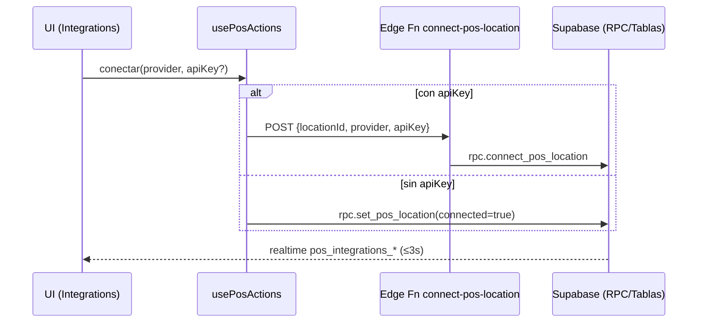
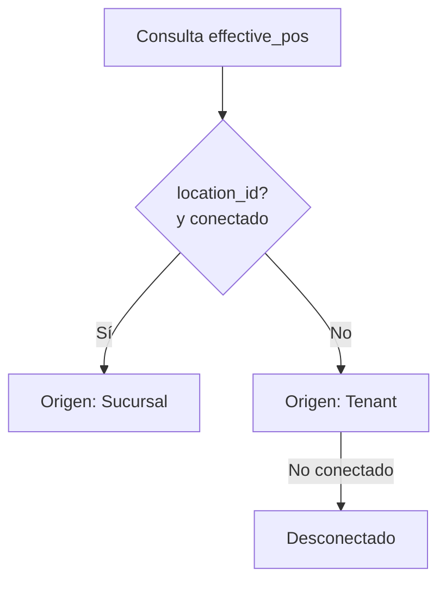

# TUPÁ Hub • Informe técnico ejecutivo (v1)

Fecha: 2025-08-09  
Ámbito: Frontend (React/Vite/TS/Tailwind), Supabase (DB, RLS, RPC, Edge Functions)

---

1) Resumen ejecutivo (para CEO no técnico)
- Qué se logró
  - Integración POS multi‑proveedor a nivel Empresa (Tenant) y Sucursal (Location) con prioridad Location>Tenant.
  - Seguridad de datos con Row‑Level Security (RLS) en Supabase y validación de roles (owner/manager/admin).
  - Observabilidad operativa: logs de procesos (pos_logs) y runs de sincronización (pos_sync_runs) con UI de estado.
  - UX clara para conexión/cambio/desconexión de POS con copys en español y CTAs según rol.
- Qué funciona
  - Lectura del estado efectivo (effective_pos RPC) con realtime para reflejo en UI en ≤3s.
  - Conexión por sucursal vía Edge Function + RPC (connect_pos_location) con validación básica de API key.
  - Permisos: owners/managers operan sucursales; baristas en solo lectura; admin plataforma gestiona global.
- Riesgos/limitaciones
  - Validación de credenciales POS aún “stub” (validate-credentials) sin verificación profunda por proveedor.
  - Falta de backfills y flujos de rotación segura de credenciales a largo plazo (secret_ref apunta a vault/kv futuro).
  - Pruebas E2E no implementadas; solo unitarias + checklist manual.
- Oportunidades
  - Validación real por proveedor (Fudo/Maxirest/Bistrosoft) y manejo de rate limits/errors específicos.
  - Fortalecer DX/observabilidad: dashboards operativos, métricas SLOs, y CI para pruebas automatizadas.

---

2) Estado actual del código
- Migraciones/RPC/RLS ya presentes
  - RPCs: effective_pos, set_pos_tenant, set_pos_location, connect_pos_location (+ varias de invitaciones/roles). Prioridad de proveedor: Sucursal > Tenant.
  - RLS por tablas clave: pos_integrations_tenant, pos_integrations_location, pos_logs, pos_sync_runs, pos_orders, pos_products, locations, tenants, user_roles, profiles, etc. Ver políticas en este documento (sección 4) y en Supabase.
  - Triggers: set_updated_at (utility), normales de perfiles/invitaciones.
  - Realtime: escuchas activas en pos_integrations_location y pos_integrations_tenant para actualizar UI.
- Tipado aplicado (sin any)
  - src/integrations/supabase/pos-types.ts: AppPosProvider, EffectivePosRow, PosAugmentedDatabase, PosSupabaseClient.
  - posSupabase: cliente centralizado tipado para evitar casts locales.
- Imports/modularización
  - Hooks: useEffectivePos y usePosActions encapsulan lectura/acciones POS.
  - API/Edge wrappers: src/lib/pos/api.ts (functions.invoke) y src/lib/pos/rpc.ts (RPC directa) para tests predecibles.
  - Componentes UI: PosConnectModal y páginas de Integraciones en app/admin.

---

3) Integraciones POS
- Flujo de conexión
  - UI (PosConnectModal) → hook usePosActions.connect →
    a) Edge Function connect-pos-location (con apiKey) → Supabase RPC connect_pos_location → set_pos_location(connected=true)
    b) O bien RPC directa set_pos_location si no hay apiKey (auto‑conexión sin credenciales).
  - UI escucha realtime en tablas pos_integrations_* y consulta effective_pos para estado unificado.
- Proveedores soportados (enum)
  - fudo, maxirest, bistrosoft, other (ERP/Otro). Escalable por enum y UI Select.
- Vista /app/settings/integrations
  - Muestra: Conectado/Desconectado, Proveedor, Origen (Sucursal/Tenant) y CTAs contextuales por rol.
  - Copys:
    - Desconectado: “Tu POS no está conectado en esta sucursal.”
    - Conectado • Origen: Sucursal • Proveedor: {{provider}}
    - Conectado • Origen: Tenant • Proveedor: {{provider}} (con hint: cambios los hace el Admin)
    - CTAs owner/manager: “Conectar POS”, “Cambiar proveedor”, “Desconectar”; CTAs Tenant: “Pedir al Admin”.
- Roles y validación
  - owner/manager: pueden conectar/cambiar/desconectar a nivel sucursal donde tengan acceso.
  - barista: solo lectura.
  - tupa_admin: control global, accesos de administración y SQL utilitario (políticas específicas).

---

4) Supabase y seguridad
- RLS (resumen relevante)
  - pos_integrations_tenant: SELECT si user_has_tenant(tenant_id).
  - pos_integrations_location: SELECT si user_has_location(location_id).
  - pos_logs: SELECT si admin o por tenant/location asociado.
  - pos_sync_runs: SELECT si admin o user_has_location(location_id).
  - profiles, user_roles, tenants, locations, orders/products/consumption: políticas específicas de lectura/escritura según rol y pertenencia (ver SQL vigente del proyecto).
- RPCs/funciones
  - effective_pos(_tenant_id, _location_id): resuelve proveedor efectivo con prioridad sucursal.
  - set_pos_tenant / set_pos_location: upsert + enforce de exclusión de múltiples proveedores conectados.
  - connect_pos_location(_location_id, _provider, _api_key): valida auth, permisos (owner/manager/admin), guarda secret_ref y activa set_pos_location.
- Edge Functions
  - validate-credentials: stub de validación (true si apiKey no vacía) + log a pos_logs.
  - connect-pos-location: orquesta validación por proveedor y llama RPC; CORS habilitado.
- Cliente Supabase tipado
  - posSupabase: SupabaseClient<PosAugmentedDatabase> para intellisense y seguridad de tipos.
- Gestión de secretos
  - Supabase Secrets presentes: SUPABASE_URL, SUPABASE_ANON_KEY, SUPABASE_SERVICE_ROLE_KEY, etc. secret_ref apunta a vault/kv (no expone API keys en frontend).

---

5) QA y pruebas realizadas
- TypeScript
  - tsc --noEmit limpio con tipados POS (EffectivePosRow, PosSupabaseClient, AppPosProvider).
- Unit tests (Vitest + mocks)
  - tests/validate-credentials.test.ts: por proveedor (“fudo”, “maxirest”, “bistrosoft”, “other”).
  - tests/connect-pos-location.test.ts: función edge via functions.invoke (éxito/forbidden/key inválida).
  - tests/rpc-connect-pos-location.test.ts: RPC directa connect_pos_location (éxito/forbidden/key inválida).
- Manual checklist (validado)
  - Conectar Fudo con key dummy → OK + Origen: Sucursal.
  - Cambiar a Maxirest → estado cambia en ≤3s (realtime).
  - Desconectar → si existe Tenant conectado, cae a Origen: Tenant; si no, “Desconectado”.
  - Rol barista → solo lectura.
  - Dashboard muestra CTA “Conectar ahora” cuando corresponde.
- Manejo de errores (toasts/UI)
  - 23505: “Ya hay un POS conectado en esta sucursal.”
  - Validación: “No pudimos validar la API key: {{reason}}.”
- Observabilidad
  - pos_logs: seguimiento de eventos validate/connect, niveles info/error.
  - pos_sync_runs: últimas ejecuciones por location/proveedor/kind.

---

6) Recomendaciones para el equipo entrante (estilo top SaaS)
- Primera semana (Foundations)
  - Endurecer validación de credenciales por proveedor (SDKs oficiales o endpoints documentados) + pruebas contractuales.
  - Pipeline CI (tsc, lint, vitest) + gating en PRs. Agregar matriz de navegadores si aplica.
  - Dashboards operativos (runs, errores, latencia realtime): panel único para On‑Call.
- Mantener
  - Modelo de permisos y RLS actual; hooks POS y cliente tipado centralizado.
  - UX de Integraciones: copys claros, CTAs por rol, feedback con toasts.
- Refactor/escala
  - Edge Function validate-credentials con adaptadores provider‑specific y errores normalizados.
  - Persistir credenciales seguras (vault/kv real detrás de secret_ref) con rotación y auditoría.
  - E2E (Playwright/Cypress) para flujos críticos: conectar/cambiar/desconectar; roles (owner/manager/barista).
  - Cuotas/rate limiting y retry/backoff por proveedor; idempotencia en sincronización.
  - Feature flags para releases graduales y dark‑launch.

---

Diagrama • Flujo de conexión POS (alto nivel)

Diagrama • Prioridad de proveedor efectivo

---

Anexos (estándar top SaaS)
A. Runbook Operativo
- Deploy: Lovable + auto‑deploy; revertir con historial/versiones. Publicación manual segura.
- Rollback: usar historial del editor o GitHub (si está integrado) con PR revert.
- Edge Logs: revisar funciones en dashboard Supabase; exportar métricas.
- Incidentes: clasificación P1–P3, comunicación, owner rotativo, post‑mortem templated.
- RTO/RPO sugeridos: RTO ≤ 30 min, RPO ≤ 5 min.

B. Observabilidad y taxonomía de logs
- pos_logs: niveles info/error/warn/debug; incluir provider, scope, location/tenant.
- Consultas base y ejemplos de agregados (errores por hora, tasa de validaciones fallidas).

C. Catálogo de Edge Functions
- validate-credentials: Entrada {provider, apiKey}; Salida {valid}; Errores: payload inválido.
- connect-pos-location: Entrada {locationId, provider, apiKey}; Efecto: RPC + logs; Errores: forbidden, API key inválida.

D. Matriz de roles → permisos (resumen)
- tupa_admin: admin global.
- owner/manager: conectar/cambiar/desconectar en locations con acceso.
- barista: lectura.

E. Realtime
- Canales: pos_integrations_location, pos_integrations_tenant; debounce 200ms para fetch.
- Recuperación: manejar reconexión y limpieza de canales onUnmount.

F. Datos/ERD (resumen)
- Tablas POS: pos_integrations_tenant, pos_integrations_location, pos_credentials, pos_logs, pos_sync_runs, pos_orders, pos_products.
- Convenciones: uuid ids, timestamps con tz, JSONB para config.

G. QA
- Matriz de pruebas por rol y estado (conectado/desconectado, tenant/location).
- Fixtures: locations/tenants demo; claves dummy con stub.

H. DX
- Scripts recomendados: tsc, vitest, lint; pre‑commit hooks.
- ADRs para decisiones (plantilla incluida).
- Checklist de PR: pruebas, seguridad, migraciones, docs.

I. UX/Contenido
- Copys auditados en vistas claves; accesibilidad mínima (labels, aria‑busy), SEO con Helmet.

J. Roadmap técnico sugerido
- Validación real por proveedor; almacenamiento secreto; E2E; dashboards SLO; backfills; límites y resiliencia.

---

Referencias rápidas
- Edge Functions: https://supabase.com/dashboard/project/ipjidjijilhpblxrnaeg/functions
- Logs validate-credentials: https://supabase.com/dashboard/project/ipjidjijilhpblxrnaeg/functions/validate-credentials/logs
- Logs connect-pos-location: https://supabase.com/dashboard/project/ipjidjijilhpblxrnaeg/functions/connect-pos-location/logs
- SQL Editor: https://supabase.com/dashboard/project/ipjidjijilhpblxrnaeg/sql/new
